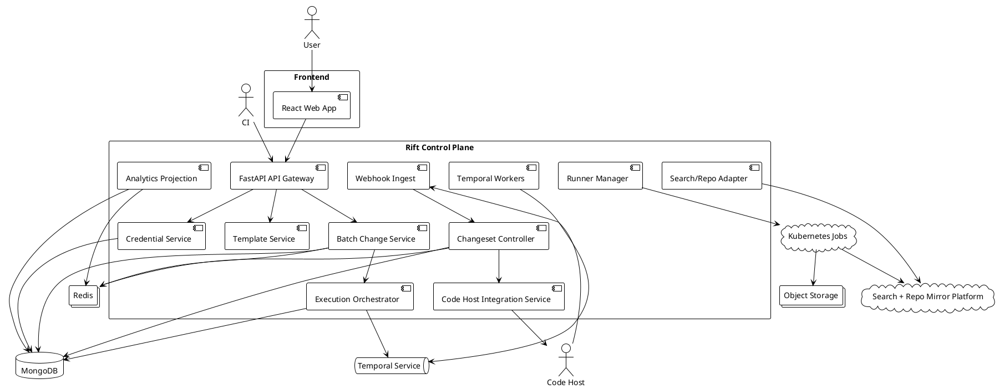
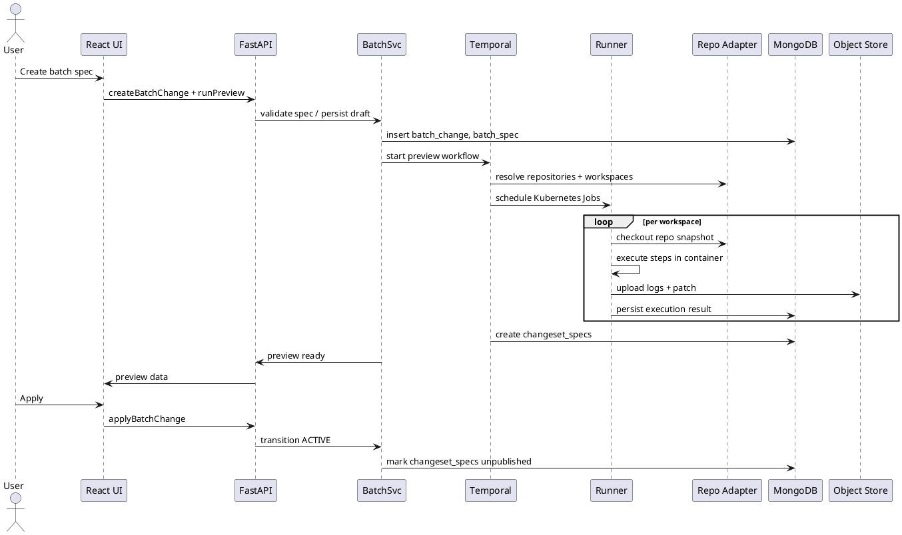
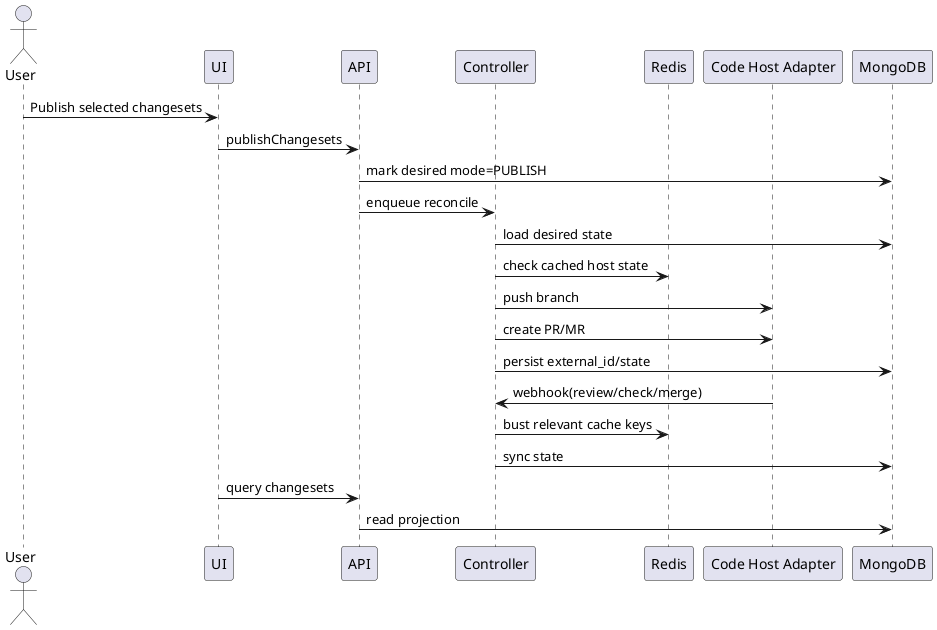

# RIFT Batch Change - HLD

## Background

Rift Batch Changes is a large-scale code automation platform for creating, previewing, publishing, and tracking code changes across many repositories and code hosts from a single declarative YAML spec.

The PRD describes three core operating modes:

1. **Server-side execution** from the Rift UI
2. **Local/CI execution** via the `src` CLI
3. **Continuous reconciliation** of published/unpublished changesets against external code hosts

This revision aligns the HLD to your requested platform choices:

* **Persistent store:** MongoDB
* **Cache:** Redis
* **Backend:** Python + FastAPI
* **Frontend:** React
* **Orchestration/deployment:** Kubernetes + Helm
* **CI/CD:** GitHub Actions

Additional explicit assumptions for the MVP:

* Rift already has or will provide **identity**, **repository search**, and **repository mirror access** as shared platform capabilities.
* MVP target scale is **5,000 repositories per batch change**, **25,000 workspace executions per day**, and **500 concurrent workspace runners** per region.
* The first production release is **single-region active/passive**.
* The system prioritizes **durability, auditability, and resumability** over minimal component count.

---

## Requirements

### Must Have

* Users can define a **batch spec YAML** with `on`, `steps`, `changesetTemplate`, and optional `workspaces`.
* Users can run batch changes from the **web UI** and from the **`src` CLI**.
* The platform can **preview diffs** before publication.
* The platform can create **unpublished changesets**, then **publish**, **draft publish**, or **push only**.
* The platform can track **changeset state** across GitHub, GitLab, Bitbucket Server/Data Center, Bitbucket Cloud, Gerrit, and extensible future hosts.
* The platform enforces **namespace-based RBAC** and **redacts repository metadata/diffs** when a user lacks read access.
* The platform stores **credentials securely** per user and org.
* The platform logs **execution details, step outputs, and timelines** for audit/debugging.
* The system must remain functional when some repositories fail, including a **skip-errors** mode.
* The system must reconcile desired vs actual changeset state continuously.
* The dashboard must show **status, CI state, review state, merge state, and burndown metrics**.

### Should Have

* Curated **template library** with typed/regex-validated inputs.
* **Webhook-first** synchronization with polling fallback for code host state.
* **Bulk actions** for publish, archive, and close.
* **Workspace-level exclusions** before apply.
* **Manual import** of externally created changesets into a tracked campaign.
* **Object-storage-backed artifacts** for patches, logs, and previews.

### Could Have

* Organization policy packs for allowed images, allowed commands, and resource limits.
* Saved views and custom analytics per batch change.
* Execution cost reporting and queue heatmaps.
* Per-host concurrency tuning and smart rate-limit adaptation.
* Template approval workflows.

### Won't Have (MVP)

* Multi-region active/active control plane.
* Cross-campaign dependency graphs.
* Built-in AST engines for every language; MVP remains **container/tool driven**.
* Phabricator support in MVP.

---

## Method

### 1. Product Method Summary

Rift should be built as a **declarative control plane** with a separate **ephemeral execution plane**.

* The **control plane** owns identities, namespaces, batch specs, changeset specs, RBAC, templates, reconciliation, and analytics.
* The **execution plane** runs isolated short-lived workspace jobs that produce diffs and metadata.
* A **desired-state reconciliation loop** keeps code host reality aligned with internal `ChangesetSpec` objects.

This model is a better fit than a purely imperative job pipeline because users declare intent once, the platform computes repository/workspace-specific desired state, and controllers continuously converge the external world toward that intent.

### 2. Similar Application Analysis

The method is informed by adjacent products:

* **Sourcegraph Batch Changes** validates the campaign + preview + reconcile pattern.
* **OpenRewrite** validates reusable transformation templates and batch automation, especially where recipe reuse matters.
* **Dependabot** validates the value of automated review creation and lifecycle tracking, although Rift must remain more general-purpose.

Therefore Rift should combine:

* the **campaign and reconciliation model** of large-scale PR orchestration,
* the **tool-pluggable execution model** of containerized automation,
* and the **dashboard/review lifecycle model** used in code automation products.

### 3. Architectural Style

Use a **modular service-oriented control plane** implemented primarily in Python/FastAPI, with clear scaling boundaries for API, orchestration workers, reconciliation workers, and ephemeral execution runners.

#### MVP deployable components

1. **React Web App**
2. **FastAPI API Gateway**
3. **Batch Change Service**
4. **Execution Orchestrator Worker**
5. **Runner Manager**
6. **Changeset Controller**
7. **Code Host Integration Service**
8. **Credential Service**
9. **Template Service**
10. **Analytics Projection Worker**
11. **Webhook Ingest Service**
12. **Search/Repo Integration Adapter**
13. **Temporal Workers**

### 4. Proposed Technology Choices

* **Frontend:** React + TypeScript
* **Backend API:** FastAPI
* **Schema/validation:** Pydantic models for API contracts and internal command models
* **Workflow orchestration:** Temporal Python SDK
* **Primary persistent database:** MongoDB
* **Cache + ephemeral coordination:** Redis
* **Artifact/log storage:** S3-compatible object storage
* **Container execution:** Kubernetes Jobs managed by Runner Manager
* **Packaging/deployment:** Helm charts on Kubernetes
* **CI/CD:** GitHub Actions with reusable workflows and protected deployment environments
* **Observability:** OpenTelemetry + Prometheus-compatible metrics + centralized logs
* **Secrets encryption:** KMS-backed envelope encryption

### 5. Top-Level Component Diagram



### 6. Service Responsibilities

#### React Web App

Handles:

* batch change creation/edit flows
* preview and changeset dashboards
* publish/bulk actions
* logs, diffs, and timeline views
* optimistic UI updates for exclusions and user actions

#### FastAPI API Gateway

Handles:

* REST APIs for product-facing operations
* authentication and authorization context propagation
* request validation via Pydantic
* pagination and field-level redaction
* SSE/WebSocket endpoint for near-real-time run updates

#### Batch Change Service

Owns:

* batch spec CRUD
* namespace ownership checks
* preview/apply lifecycle
* workspace inclusion/exclusion rules
* manual import of external changesets

#### Execution Orchestrator

Owns:

* converting a batch spec into executable work items
* fan-out/fan-in workflow execution using Temporal
* retry policies
* partial failure semantics
* state transitions for preview and apply runs

#### Runner Manager

Owns:

* creating isolated Kubernetes Jobs for workspace execution
* selecting runner image/resource class
* image allowlisting
* TTL cleanup
* collecting logs, metadata, patch files, and output variables

#### Changeset Controller

Owns:

* desired-state reconciliation for each changeset
* publish/push/draft transitions
* sync of review/CI/merge state
* close/archive actions
* webhook and polling fallback processing

#### Code Host Integration Service

Owns:

* host adapters
* branch creation
* PR/MR/change creation
* status retrieval
* rate limit handling
* webhook verification

#### Analytics Projection Worker

Owns:

* denormalized dashboard documents
* burndown computation
* hours-saved estimates
* daily/time-series rollups

### 7. API Design

Use **REST + server-sent events** for MVP. This keeps the FastAPI implementation simple and makes it easy for the React client and CLI to share the same contracts.

#### Core endpoints

* `POST /batch-changes`
* `PUT /batch-changes/{id}/spec`
* `POST /batch-changes/{id}/preview`
* `POST /batch-changes/{id}/apply`
* `POST /batch-changes/{id}/publish`
* `POST /batch-changes/{id}/close`
* `POST /batch-changes/{id}/archive`
* `POST /batch-runs/{id}/workspaces/{workspaceId}/exclude`
* `POST /credentials`
* `POST /batch-changes/{id}/imports`
* `GET /batch-changes/{id}`
* `GET /batch-changes/{id}/changesets`
* `GET /batch-runs/{id}`
* `GET /templates`
* `GET /audit-events`
* `GET /streams/batch-runs/{id}` for live run updates

### 8. Execution Plane Design

Each repository/workspace combination becomes one **Workspace Execution**.

Execution flow:

1. Resolve repositories from the `on` query.
2. Expand workspaces per repository.
3. Materialize one work item per `(repo, workspace)`.
4. Start one Kubernetes Job per work item.
5. Mount or clone a repository snapshot from internal repo mirrors.
6. Run steps inside the declared container image with controlled environment variables.
7. Capture filesystem diff, stdout/stderr, step timings, and declared outputs.
8. Render `changesetTemplate` with outputs.
9. Persist a `ChangesetSpec` for every successful work item.
10. Aggregate failures separately without blocking successful specs unless the user requested fail-fast.

#### Runner isolation policy

* non-root containers only
* read/write ephemeral workspace volume only
* no Docker socket mount
* default deny egress, with allowlists for package mirrors and code hosts where needed
* CPU/memory quotas per template class
* max execution wall-clock per workspace (default 20 minutes)

### 9. State Model

#### Batch Change

* `DRAFT`
* `PREVIEW_RUNNING`
* `PREVIEW_READY`
* `APPLYING`
* `ACTIVE`
* `PAUSED`
* `ARCHIVED`
* `FAILED`

#### Workspace Execution

* `QUEUED`
* `RUNNING`
* `SUCCEEDED`
* `FAILED`
* `CANCELLED`
* `SKIPPED`

#### Changeset Spec

* `UNPUBLISHED`
* `PUBLISHING`
* `PUBLISHED`
* `FAILED`
* `CLOSING`
* `CLOSED`
* `MERGED`
* `ARCHIVED`

### 10. Reconciliation Algorithm

The controller reconciles each changeset independently.

#### Desired state inputs

* rendered title/body/commit/branch
* publication mode (`publish`, `draft`, `push`)
* target repository/branch/workspace
* credential scope
* close/archive intent

#### Actual state inputs

* existing branch state on host
* PR/MR/change existence
* open/closed/merged status
* review state
* CI/check status
* remote title/body drift

#### Reconcile pseudocode

```text
for each eligible changeset:
  load desired_state
  load actual_state from cache or host adapter

  if desired_state.archived:
      archive locally and stop

  if desired_state.close_requested and actual_state.is_open:
      close on code host
      persist closed state
      continue

  if desired_state.mode == UNPUBLISHED:
      persist preview-only state
      continue

  if actual_state.missing_branch and desired_state.requires_branch:
      push branch

  if actual_state.missing_review and desired_state.requires_review:
      create PR/MR/change

  if actual_state.review_exists:
      update title/body when safe and configured
      sync CI/review/merge status

  if actual_state.merged:
      persist merged timestamp and stop aggressive reconciliation
```

#### Idempotency rules

* reconciliation key: `(changeset_spec_id, target_host, target_repo, branch_name)`
* host operations use idempotency metadata where supported
* retries store last error class and exponential backoff metadata
* publish operations must tolerate worker restarts without duplicate PRs

### 11. MongoDB Data Model

MongoDB is the source of truth for product state. Collections are document-oriented, but write paths still preserve strict IDs, state transitions, and optimistic concurrency.

#### Collection strategy

* one primary document per business aggregate
* event/history documents appended separately
* precomputed dashboard documents stored in dedicated projection collections
* large logs/patches remain in object storage, not MongoDB

#### Core collections

##### `users`

```json
{
  "_id": "usr_...",
  "email": "user@example.com",
  "display_name": "Jane Doe",
  "auth_subject": "oidc|...",
  "created_at": "..."
}
```

##### `organizations`

```json
{
  "_id": "org_...",
  "name": "Acme",
  "slug": "acme",
  "created_at": "..."
}
```

##### `namespaces`

```json
{
  "_id": "ns_...",
  "kind": "USER",
  "owner_user_id": "usr_...",
  "owner_org_id": null,
  "visibility_policy": {
    "redact_repo_details": true
  }
}
```

##### `code_hosts`

```json
{
  "_id": "ch_...",
  "kind": "GITHUB",
  "base_url": "https://github.com",
  "display_name": "GitHub",
  "is_active": true
}
```

##### `credentials`

```json
{
  "_id": "cred_...",
  "namespace_id": "ns_...",
  "user_id": "usr_...",
  "code_host_id": "ch_...",
  "encrypted_secret": "...",
  "kms_key_ref": "...",
  "scopes": ["repo", "pull_request:write"],
  "created_at": "...",
  "rotated_at": null
}
```

##### `repositories`

```json
{
  "_id": "repo_...",
  "external_repo_ref": "github.com/acme/service-a",
  "code_host_id": "ch_...",
  "name": "acme/service-a",
  "default_branch": "main",
  "mirror_ref": "mirror://...",
  "visibility": "private",
  "last_synced_at": "..."
}
```

##### `batch_changes`

```json
{
  "_id": "bc_...",
  "namespace_id": "ns_...",
  "name": "upgrade-foo-lib",
  "description": "Upgrade foo-lib to v9",
  "source_mode": "UI",
  "state": "DRAFT",
  "created_by": "usr_...",
  "active_spec_id": "bs_...",
  "created_at": "...",
  "updated_at": "...",
  "archived_at": null,
  "version": 3
}
```

##### `batch_specs`

```json
{
  "_id": "bs_...",
  "batch_change_id": "bc_...",
  "spec_yaml": "...",
  "spec_hash": "sha256:...",
  "template_bindings": {
    "version": "9.1.0"
  },
  "search_query": "repo:acme/* file:package.json",
  "created_at": "..."
}
```

##### `batch_runs`

```json
{
  "_id": "br_...",
  "batch_change_id": "bc_...",
  "batch_spec_id": "bs_...",
  "mode": "PREVIEW",
  "state": "RUNNING",
  "skip_errors": true,
  "requested_by": "usr_...",
  "started_at": "...",
  "completed_at": null,
  "summary": {
    "total": 1000,
    "succeeded": 700,
    "failed": 20,
    "pending": 280
  }
}
```

##### `workspace_executions`

```json
{
  "_id": "we_...",
  "batch_run_id": "br_...",
  "repository_id": "repo_...",
  "workspace_path": "/",
  "state": "RUNNING",
  "exclusion_reason": null,
  "runner_job_ref": "job/rift-runner-123",
  "started_at": "...",
  "completed_at": null
}
```

##### `execution_steps`

```json
{
  "_id": "step_...",
  "workspace_execution_id": "we_...",
  "step_index": 0,
  "container_image": "ghcr.io/acme/tooling:1.0.0",
  "command_text": "npm install && npm test",
  "exit_code": 0,
  "started_at": "...",
  "completed_at": "...",
  "stdout_artifact_key": "...",
  "stderr_artifact_key": "...",
  "diff_artifact_key": "...",
  "outputs": {
    "packageVersion": "9.1.0"
  }
}
```

##### `changeset_specs`

```json
{
  "_id": "css_...",
  "batch_change_id": "bc_...",
  "workspace_execution_id": "we_...",
  "repository_id": "repo_...",
  "workspace_path": "/",
  "base_rev": "abc123",
  "head_ref": "rift/upgrade-foo-lib/repo-a",
  "publication_mode": "UNPUBLISHED",
  "title_rendered": "Upgrade foo-lib to 9.1.0",
  "body_rendered": "...",
  "commit_message_rendered": "chore: upgrade foo-lib to 9.1.0",
  "branch_name_rendered": "rift/upgrade-foo-lib/repo-a",
  "patch_artifact_key": "...",
  "spec_fingerprint": "sha256:...",
  "state": "UNPUBLISHED",
  "created_at": "..."
}
```

##### `changesets`

```json
{
  "_id": "cs_...",
  "changeset_spec_id": "css_...",
  "code_host_id": "ch_...",
  "external_id": "12345",
  "external_url": "https://github.com/acme/service-a/pull/123",
  "branch_ref": "rift/upgrade-foo-lib/repo-a",
  "is_draft": false,
  "state": "OPEN",
  "review_state": "PENDING",
  "check_state": "RUNNING",
  "published_at": "...",
  "merged_at": null,
  "closed_at": null,
  "last_synced_at": "..."
}
```

##### `changeset_events`

```json
{
  "_id": "cse_...",
  "changeset_id": "cs_...",
  "event_type": "CI_STATUS_CHANGED",
  "payload": {
    "old": "RUNNING",
    "new": "PASSED"
  },
  "occurred_at": "..."
}
```

##### `templates`

```json
{
  "_id": "tpl_...",
  "namespace_id": null,
  "name": "node-dependency-upgrade",
  "description": "Upgrade a Node dependency across repos",
  "spec_template_yaml": "...",
  "form_schema": {"type": "object"},
  "validation_rules": {
    "version": "^\d+\.\d+\.\d+$"
  },
  "is_builtin": true,
  "is_active": true
}
```

##### `audit_events`

```json
{
  "_id": "ae_...",
  "actor_user_id": "usr_...",
  "namespace_id": "ns_...",
  "resource_type": "batch_change",
  "resource_id": "bc_...",
  "action": "publish_changesets",
  "payload": {},
  "created_at": "..."
}
```

### 12. MongoDB Index Plan

#### Required compound indexes

* `batch_changes`: `{ namespace_id: 1, updated_at: -1 }`
* `batch_specs`: `{ batch_change_id: 1, created_at: -1 }`
* `batch_runs`: `{ batch_change_id: 1, started_at: -1 }`
* `workspace_executions`: `{ batch_run_id: 1, state: 1 }`
* `workspace_executions`: `{ repository_id: 1, batch_run_id: 1 }`
* `changeset_specs`: `{ batch_change_id: 1, repository_id: 1, workspace_path: 1 }`
* `changeset_specs`: `{ spec_fingerprint: 1 }`, unique when applicable
* `changesets`: `{ changeset_spec_id: 1 }`, unique
* `changesets`: `{ code_host_id: 1, external_id: 1 }`, unique sparse
* `changesets`: `{ batch_change_id: 1, state: 1, review_state: 1, check_state: 1 }`
* `changeset_events`: `{ changeset_id: 1, occurred_at: -1 }`
* `audit_events`: `{ namespace_id: 1, created_at: -1 }`
* `templates`: `{ namespace_id: 1, is_active: 1 }`

#### Concurrency controls

* every mutable aggregate includes a `version` field for optimistic concurrency
* state transitions use conditional updates on `_id + version`
* projections are rebuilt idempotently from primary documents + events

### 13. Redis Cache Design

Redis is not the source of truth. It is used for speed, burst absorption, and short-lived coordination.

#### Cache keys

* `repo-search:{namespace}:{queryHash}` → repository search result IDs
* `batch-summary:{batchChangeId}` → dashboard aggregate summary
* `changeset-page:{batchChangeId}:{filterHash}:{page}` → paginated list cache
* `perm-check:{userId}:{repoId}` → resolved read permission
* `host-state:{codeHostId}:{externalId}` → recent PR/MR/check state snapshot
* `rate-limit-budget:{codeHostId}:{tokenBucket}` → distributed throttle counters

#### Cache policies

* repo search: TTL 5 minutes
* dashboard summary: TTL 30 seconds, explicit bust on controller updates
* permission checks: TTL 1 minute
* host-state snapshots: TTL 15-60 seconds depending on host/webhook freshness

### 14. Read Models for Dashboard

Store denormalized read models in MongoDB.

##### `batch_change_stats`

```json
{
  "_id": "bc_...",
  "total_workspaces": 1000,
  "successful_specs": 980,
  "failed_workspaces": 20,
  "unpublished_count": 100,
  "open_count": 600,
  "merged_count": 250,
  "closed_count": 30,
  "ci_passed_count": 540,
  "ci_failed_count": 40,
  "review_approved_count": 210,
  "estimated_hours_saved": 132.5,
  "last_recomputed_at": "..."
}
```

##### `batch_change_burndown_daily`

```json
{
  "_id": "bc_...:2026-03-23",
  "batch_change_id": "bc_...",
  "date": "2026-03-23",
  "merged_count": 250,
  "open_count": 600,
  "remaining_count": 730
}
```

### 15. Access Control and Redaction

RBAC is enforced at API query time and artifact access time.

#### Principles

* namespace membership controls ownership and mutation
* repository read permission controls visibility into repo name, file paths, diffs, logs, and external URLs
* a user may see aggregate counts even when details are redacted, if org policy allows

#### Redaction policy

When a user lacks repository read access:

* replace repo name with `REDACTED_REPOSITORY`
* hide file paths and patch content
* hide step output lines that reveal path names or secrets
* retain coarse execution state only

### 16. Credential Management

Credentials are stored using envelope encryption.

#### Write path

1. API receives token from UI/CLI.
2. Token is encrypted with a generated data key.
3. Data key is encrypted using cloud KMS.
4. Ciphertext and KMS reference are stored in `credentials`.

#### Read path

1. Caller action is authorized against namespace and host.
2. Service decrypts token in memory only.
3. Token is injected into the adapter or runner as a short-lived env var or temp file.
4. Secrets never persist in logs or artifacts.

#### Security controls

* secret scanning on logs/artifacts before persistence
* token fingerprinting for duplicate detection without revealing value
* rotation audit trail
* optional admin-enforced host credentials

### 17. CLI Contract

The `src` CLI should support two modes.

#### Mode A: Local preview/apply

* parse spec locally
* call Rift API for auth, namespace resolution, and optional repository targeting expansion
* execute steps locally or in CI against retrieved repositories
* upload execution bundle (`patch`, `metadata`, `logs`, `rendered template outputs`)
* server persists `ChangesetSpec` and enters standard publish/track flow

#### Mode B: Remote execution trigger

* upload spec only
* server executes the same run using the server-side execution plane

Both modes normalize into the same internal object model:
`BatchRun -> WorkspaceExecution -> ChangesetSpec -> Changeset`

### 18. Sequence Diagram: Server-Side Preview + Apply



### 19. Sequence Diagram: Publish + Reconcile



### 20. Failure Handling

#### Failure classes

* invalid spec or template render failure
* repository resolution failure
* checkout failure
* step runtime failure
* patch generation failure
* credential failure
* code host API rate limit or transient API failure
* webhook loss or duplication
* projection lag or cache stampede

#### Recovery strategy

* Temporal retries transient orchestration steps
* workspace runners retry only safe steps
* host adapter uses backoff and distributed throttle counters in Redis
* controller is webhook-first, poll-second
* stuck Jobs are reaped by TTL policy and marked failed deterministically
* projection rebuilds are idempotent and can replay from canonical documents

### 21. Scalability Design

#### Horizontal scaling units

* React frontend pods scale by request load
* FastAPI pods scale by API traffic
* Temporal workers scale by workflow throughput
* runner Jobs scale by workspace concurrency budget
* controller workers scale by active changeset count and webhook volume

#### Key scalability decisions

* one workspace per Kubernetes Job to avoid noisy-neighbor effects
* logs/patches stored outside MongoDB
* projection collections for dashboard queries
* Redis absorbs hot reads and permission checks
* polling budget partitioned by host and organization
* repository snapshots fetched from internal mirrors instead of repeated remote clones

#### Expected bottlenecks

* code host API rate limits
* large monorepo diff generation
* MongoDB write amplification from event churn
* cache invalidation pressure during large bulk publish waves

### 22. Availability and SLOs

#### MVP target SLOs

* API availability: **99.9% monthly**
* preview start latency: **< 60s** from user action to first runner start at p95
* changeset dashboard page load: **< 2s** p95 for first page
* webhook-to-UI state freshness: **< 30s** p95
* publish success for healthy repos/credentials: **> 99%**

### 23. Kubernetes and Helm Deployment Topology

Run on Kubernetes in one region.

#### Workload types

* **Deployments:** React web app, FastAPI API, code host integration service, webhook service, controller workers, analytics workers, Temporal workers
* **Jobs:** ephemeral workspace runners
* **CronJobs:** reconciliation backstop polling, stale runner cleanup, projection repair, retention cleanup

#### Helm packaging

Use one **umbrella chart** with subcharts/modules for:

* `frontend`
* `api`
* `workers`
* `runners`
* `ingress`
* `network-policies`
* `service-accounts-rbac`
* `external-dependencies` references (MongoDB, Redis, object storage, Temporal)

#### Recommended namespaces

* `rift-frontend`
* `rift-api`
* `rift-workers`
* `rift-runners`
* `rift-observability`

#### Network boundaries

* public ingress: React web app, FastAPI API, webhook endpoints
* private only: MongoDB, Redis, Temporal, object storage internal endpoint, runner control APIs, repo mirrors
* runner Jobs use restricted egress policies

### 24. CI/CD with GitHub Actions

Use GitHub Actions for both CI and CD.

#### Workflow layout

1. **`ci-backend.yml`**

   * lint Python
   * run unit tests
   * run API contract tests
   * build backend image
   * run vulnerability scan

2. **`ci-frontend.yml`**

   * install dependencies
   * lint React app
   * run unit tests
   * build static bundle
   * build frontend image

3. **`ci-helm.yml`**

   * lint Helm charts
   * template render validation
   * policy checks

4. **`cd-staging.yml`**

   * deploy tagged commit to staging using Helm
   * run smoke tests

5. **`cd-production.yml`**

   * protected environment approval
   * Helm upgrade to production
   * post-deploy verification
   * rollback on failed health gate

#### CI/CD principles

* reusable workflows for shared build steps
* environment protection rules for production
* concurrency groups to prevent overlapping deploys to the same environment
* image tags based on commit SHA + semver release tags
* supply chain checks before deploy

### 25. Observability

#### Metrics

* batch preview duration
* workspace success/failure rate
* code host publish latency
* webhook lag
* reconciliation queue depth
* FastAPI request latency/error rate
* MongoDB query latency and lock pressure
* Redis hit ratio and eviction rate
* runner CPU/memory saturation

#### Tracing

* request trace from React-triggered API call through FastAPI, Temporal workflow, runner scheduling, and controller sync

#### Logging

* structured logs with `batch_change_id`, `batch_run_id`, `workspace_execution_id`, `changeset_id`, `code_host_id`
* secret redaction middleware before sink

### 26. Data Retention

* execution logs: 30 days hot, 180 days cold
* patches/previews: 90 days or until archived policy purge
* audit events: 1 year minimum
* changeset event history: 180 days
* merged/closed changeset summary docs: retained indefinitely unless tenant policy says otherwise

### 27. MVP Delivery Boundaries

The MVP is successful when it supports:

* React UI + CLI creation of batch changes
* preview/apply flow
* unpublished/publish/draft/push states
* GitHub + GitLab adapters first
* dashboard with changeset status, CI, review state, burndown, and bulk publish
* encrypted per-user/org credentials
* RBAC + redaction
* monorepo workspaces
* FastAPI backend with MongoDB persistence and Redis cache
* GitHub Actions driven deployment to Kubernetes via Helm

Bitbucket, Gerrit, Perforce, import flows, and advanced policy packs can follow behind stable core abstractions.

---

## Implementation

### Phase 1: Foundations

1. Stand up Kubernetes, MongoDB, Redis, object storage, Temporal, KMS integration.
2. Build auth middleware, namespace model, and RBAC primitives in FastAPI.
3. Define Pydantic request/response contracts and create MongoDB collections/indexes.
4. Build repository/search adapter contract against existing Rift platform services.
5. Create base Helm chart structure and GitHub Actions reusable workflows.

### Phase 2: Core Batch Change Lifecycle

1. Implement batch spec CRUD and YAML validation.
2. Implement template rendering and regex/form validation.
3. Implement preview workflow and workspace fan-out in Temporal.
4. Implement runner Job creation, artifact upload, and result ingestion.
5. Persist `ChangesetSpec` documents and preview views.

### Phase 3: Publication and Tracking

1. Build code host adapter interface.
2. Implement GitHub adapter.
3. Implement GitLab adapter.
4. Build changeset controller and idempotent reconciliation loop.
5. Add webhook ingest and polling fallback CronJobs.
6. Add Redis caching for dashboard and host-state lookups.

### Phase 4: Dashboard and Analytics

1. Build React changeset list, filters, and bulk actions.
2. Build projection collections and burndown jobs.
3. Add CI/review status rollups and hours-saved estimation.
4. Implement archive/close flows and SSE live updates.

### Phase 5: Security and Hardening

1. Envelope encryption for credentials.
2. Secret redaction in logs and diffs.
3. Runner egress policies and image allowlist.
4. Rate limiting, backoff, and quota controls.
5. Backup/restore validation for MongoDB and object storage.
6. Production deploy gates in GitHub Actions environments.

### Phase 6: Expansion

1. Add Bitbucket adapters.
2. Add Gerrit support.
3. Add manual changeset import.
4. Add org-curated templates and policy packs.

---

## Milestones

### M1 — Platform Baseline

* Kubernetes, Helm, MongoDB, Redis, Temporal, object storage ready
* namespaces, RBAC, and API skeleton complete
* GitHub Actions CI foundation running

### M2 — Preview MVP

* batch spec creation works
* preview runs fan out to Kubernetes Jobs
* diffs/logs visible in React UI
* workspace exclusion supported

### M3 — Publish MVP

* GitHub/GitLab publish works
* unpublished/publish/draft/push lifecycle works
* controller reconciles status correctly

### M4 — Dashboard and Cache Optimization

* changeset dashboard live
* filters, bulk publish, burndown chart, audit trail complete
* Redis-backed hot-path caching in place

### M5 — Production Readiness

* RBAC redaction verified
* credentials encrypted
* SLO dashboards, alerts, backups, chaos tests complete
* GitHub Actions production deploy protections enabled

### M6 — Host Expansion

* Bitbucket/Gerrit support added
* import tracking live

---

## Gathering Results

Evaluate the architecture in production with the following checks.

### Functional validation

* Can one YAML spec create previews across at least 1,000 repositories?
* Can users publish selected changesets in bulk and see accurate lifecycle updates?
* Can org admins restrict visibility so unauthorized users see only redacted summaries?
* Can CLI and UI runs converge into the same dashboard and controller behavior?

### Performance validation

* p95 preview workflow completion time by repository count bucket
* p95 publish latency by code host
* webhook lag and reconciliation lag
* MongoDB query latency under heavy event churn
* Redis hit ratio on hot dashboard queries

### Reliability validation

* success rate of workspace executions
* success rate of publish attempts
* duplicate-PR incident count
* recovery time after worker restart or node loss

### Business validation

* repositories changed per batch change
* merged changesets over time
* hours saved estimate per organization
* monthly active batch change creators
* security patch lead time reduction
